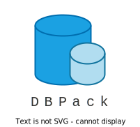
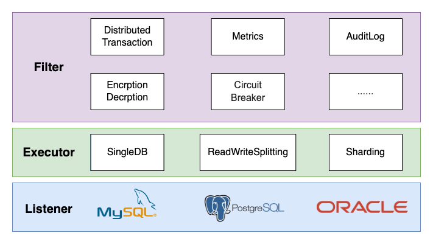

# DBPack

## 中文 | [English](./en-us/README.md)

> 它是一个数据库代理，目标是解决业务开发中遇到的分布式事务问题，并提供读写分离、分库分表的解决方案。通过 Mesh 化的部署方式，屏蔽复杂的基础逻辑，使业务开发无需依赖特定的 SDK，简化开发流程，提高开发效率。

## 特性

+ 支持 MYSQL 协议
+ 简单易用的分布式事务
+ 支持读写分离，支持通过 Hint 自定义 SQL  路由
+ 使用 sidecar 模式部署，可使用任意语言开发业务
+ 查询请求跨分片、跨 DB，支持 Order By，支持 Limit
+ 根据 sharding key 计算插入数据落在哪个分片
+ 更多特性正在开发中

## 必要条件

+ Go 1.17 或者更高版本
+ MYSQL (5.7+)

## 架构

+ Listener 监听器：负责解析 SQL 协议。
+ Executor 执行期：负责转发 SQL 请求到后端物理 DB。
+ Filter 过滤器：负责做指标统计、SQL 拦截、敏感信息加解密等工作。
+ ConnectionFilter 数据库连接过滤器：对连接上的 SQL 拦截做处理。

## 讨论群

进入微信讨论群，请扫描下面的二维码，回复“进群”。

