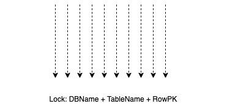
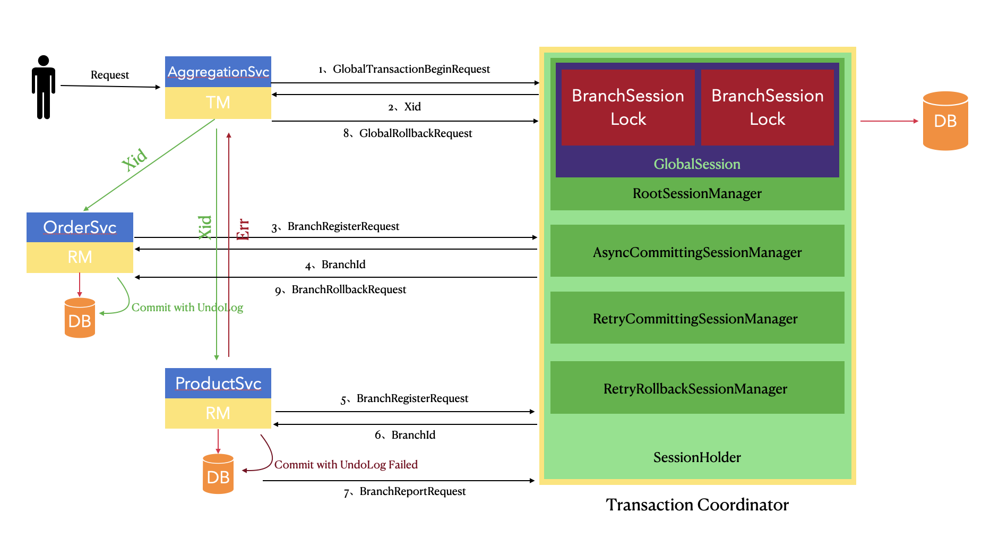
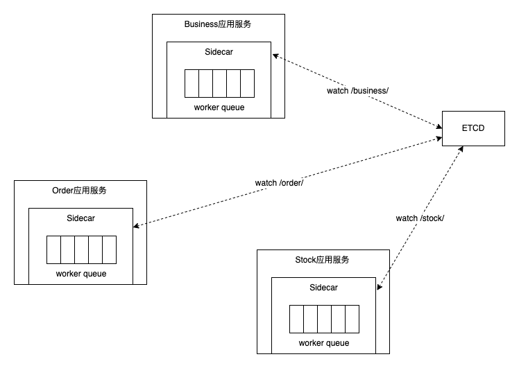
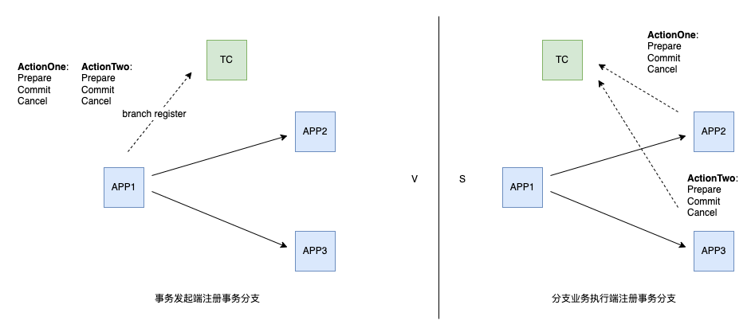

# 中国电子云数据库 Mesh 项目 DBPack 的实践

作者：刘晓敏    2022 年 5 月 9 日

2022 年 4 月，中国电子云开源了其云原生数据库 Mesh 项目 DBPack。该项目的诞生，旨在解决用户上云过程中面临的一些技术难点，诸如分布式事务、分库分表等。由于它数据库 Mesh 的定位，意味着它可以支持任意微服务编程语言。

## 分布式事务

DBPack 的分布式事务致力于实现对用户的业务无入侵，它对 HTTP 流量和 MYSQL 流量做了拦截代理，支持 AT 模式（自动补偿 SQL）和 TCC 模式（自动补偿 HTTP 请求）。

DBPack 从 Kubernetes control loop 思想中获得灵感，采用 ETCD Watch 机制来驱动分布式事务提交回滚。在采用代理使连接增加一跳的情况下，它的性能相比采用 MYSQL 存储的分布式事务解决方案 seata-golang 性能提高了百分之 50。

 

### AT 模式

AT 模式的性能取决于全局锁的释放速度，哪个事务竞争到了全局锁就能对业务数据做修改，在单位时间内，全局锁的释放速度越快，竞争到锁的事务越多，性能越高。从 [ETCD 官方 Bench 测试数据](https://etcd.io/docs/v3.4/op-guide/performance/)中可以看到，ETCD 在高并发下，读写延迟很低，不同并发压力下写延迟 2 毫秒到 20 毫秒不等，读延迟基本在 10 毫秒以内。采用 ETCD 来存储全局锁是 DBPack 分布式事务性能提升的关键。

上图展示了 seata-golang 协调一个分布式事务的交互逻辑。从图上我们可以看出，事务发起者（TM）和事务协调者（TC）间存在*创建（开始）全局事务*、*提交（回滚）全局事务* RPC 交互。事务参与者（RM）和事务协调者（TC）间存在*注册分支事务*、*报告分支事务执行状态* RPC 交互。事务协调者（TC）和 MYSQL 交互保存状态数据。

而 DBPack 创建全局事务、注册分支事务只是在 ETCD 插入两条 KV 数据，事务提交回滚时修改对应数据的状态，DBPack Sidecar 通过 ETCD Watch 机制感知到数据的变化就能立即处理数据的提交回滚，从而在交互上减少了很多 RPC 请求。

 

各 Sidecar Watch 应用产生的数据，各自处理，实际上已经没有中心化的事务协调者，架构也变得简单了。核心的事务协调逻辑代码包括配置代码都比 Seata-golang 大幅减少。所以 DBPack 以全新的云原生的思路，带了更简洁的架构和更高的性能。

[seata-golang 事务协调核心代码](https://github.com/opentrx/seata-golang/blob/v2/pkg/tc/server/transaction_coordinator.go)

[dbpack 事务协调核心代码](https://github.com/CECTC/dbpack/blob/dev/pkg/dt/distributed_transaction_manger.go)

DBPack 支持所有微服务编程语言，[samples](https://github.com/CECTC/dbpack/tree/dev/samples) 中已提供了 Go 语言和 Java 语言的例子，PHP 和 Python 的例子也在开发中。

### TCC 模式

提到 TCC 模式，大家可能第一时间想到 TCC 模式可能存在的问题：幂等性、防悬挂等。事务悬挂产生的原因是什么？其实这是一个很**伪**的问题！

APP1 在调用 APP2 的 Prepare 方法之前，事务框架根据上下问信息，自动把 Commit、Cancel 需要执行的方法名以及 Prepare 方法执行的上下文告诉事务协调者（注册分支事务），再执行 Prepare 方法。如果执行 APP1 调用 APP2 的 Prepare 方法的时候，发生网络问题，导致 APP2 迟迟没有收到 Prepare 请求，事务协调者经过一定时间后，认为全局事务超时，则 TC 根据注册上来的事务分支信息发起全局回滚，此时，APP1 向 APP2 发起一个 Cancel 请求，很巧的是，APP2 端 Cancel 请求比 Prepare 请求先到达，事务空回滚后，再收到 Prepare 请求，Prepare 如果正常执行了，那就完了，全局事务已经回滚了，这个 Prepare 操作永远也不会提交、回滚，事务挂起了，数据不一致了。

首先，这种概率很小，其次，为什么一定要在 Prepare 网络请求之前注册分支事务，可不可以在 APP2 收到 Prepare 请求执行业务代码之前注册，这时候一定能确定 Prepare 请求已经到了，Cancel 请求确定能在 Prepare 请求之后发生，是不是就不存在悬挂问题了。

实际上 seata-golang 诞生之时就支持在分支业务执行端注册 TCC 分支事务，但大家可能没有深入思考这个问题，机械地认为事务悬挂必然会发生。

DBPack 也是在请求到达 sidecar 后再注册 TCC 事务分支，确保 Prepare 先于 Cancel 执行。有人说因为 CPU 调度的原因，还是可能出现 Cancel 先于 Prepare 执行的情况，但这种概率非常非常低。具体到操作的业务数据，建议使用 XID 和 BranchID 加锁。

## 读写分离

DBPack 当前支持对 SQL 请求自动路由，写请求路由到写库，读请求路由到读库。在开启事务的情况下，请求自动路由到写库。同时，也可以通过 SQL Hint 自动路由读请求到用户指定的数据库。

## 分库分表

分库分表的功能目前还在开发中，当前已经支持跨分片、跨 DB 的查询请求，支持 Order By 和 Limit。

## 结语

更多特性我们也在积极开发中，DBPack 社区非常 Open，进入到社区我们都是平等的开源爱好者，在这里你也可以成长为大佬，欢迎感兴趣的同学与我们一起建设 DBPack 社区。进群或参与社区建设请添加微信：scottlewis。

## 链接

DBPack 项目地址：https://github.com/cectc/dbpack

DBPack 文档：https://cectc.github.io/dbpack-doc/#/

