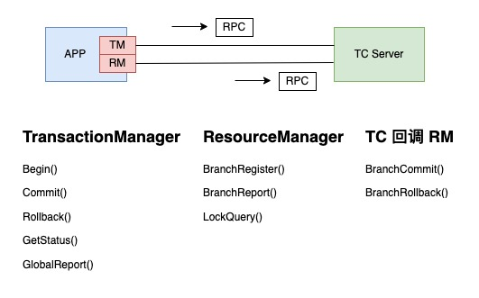
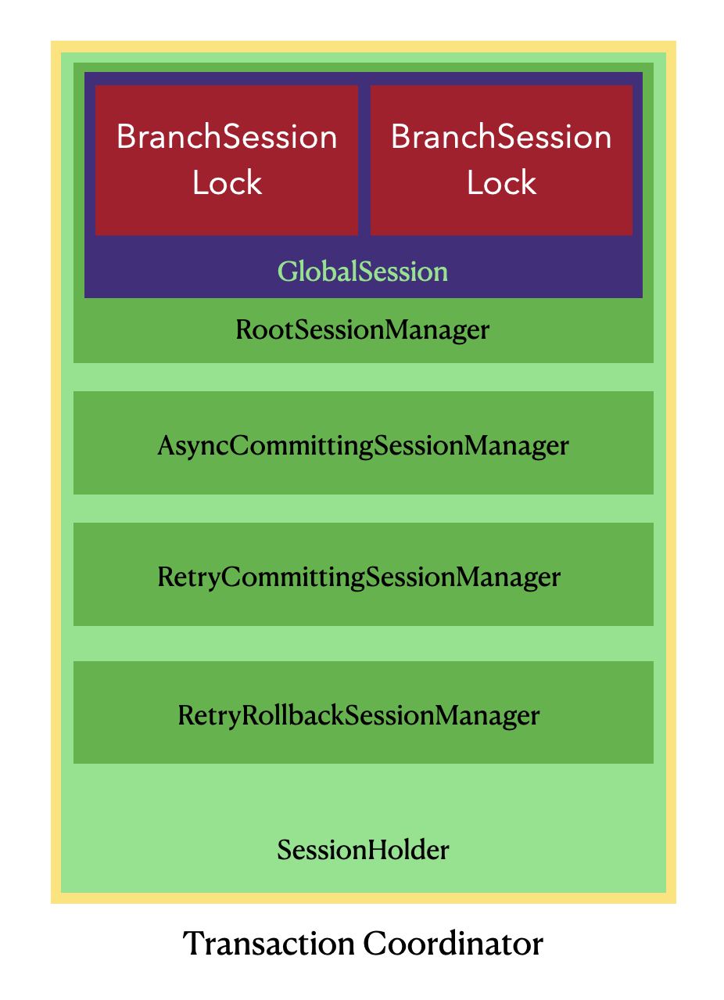
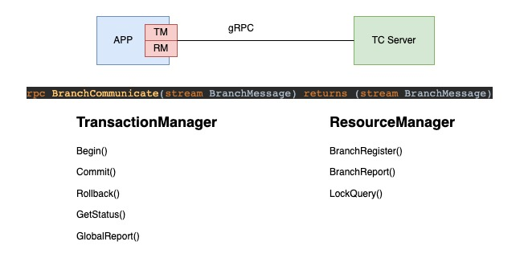
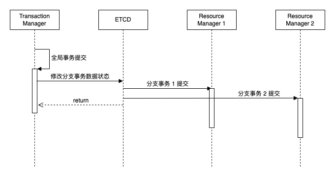
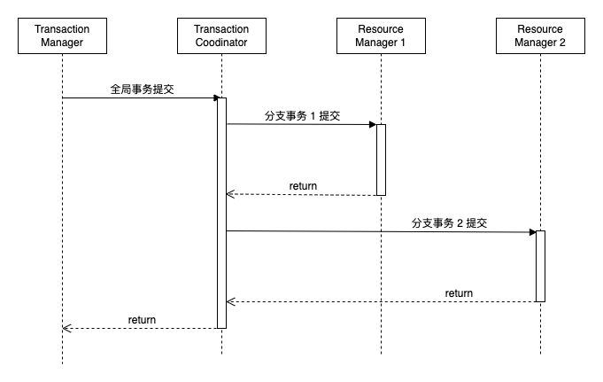

# 分布式事务框架的演进

2019 年 1 月，阿里中间件部门开源了分布式事务框架 SEATA。笔者从 SEATA 开始开源就关注着 SEATA 社区的发展。同时，随着 Kubernetes、istio 等技术的流行，笔者开始转向 Golang 技术栈，逐渐萌生了开发一款 Go 语言的分布式事务框架的想法。2020 年 4 月，这一想法开始付诸行动，并在 github 开源了项目 seata-golang。经过约 2 个月的时间，seata-golang 发布了 v1 版本。但在开发过程中，也发现 SEATA 设计上的一些不合理之处。

## 一、存在的问题

### 1、非云原生设计



SEATA 的 client 严格区分了 TransactionManager (TM) 和 ResourceManager (RM)，在和 TC Server 通信的时候，TM 和 RM 都会和 TC Server 建立连接。在 TM 与 TC Server 建立的连接上，只能发送全局事务的开启、提交、回滚等请求。在RM 与 TC Server 建立的连接上，只能发送事务分支注册、分支事务执行结果报告、全局锁查询等请求。TM 的的连接上不能发送 RM 的请求，RM 的连接上不能发送 TM 的请求。这就造成连接管理的逻辑非常复杂，在 TC Server 上的连接管理就要区分 TM 连接和 RM 连接。事务分支注册的请求，它的响应必须通过 RM 连接发往 client，如果通过 TM 的连接发送，则响应消息无法解析。

同时，一个应用的多个副本都会与 TC Server 建立连接，TC Server 的内部使用了一个多层嵌套的 Map 结构来保存这些连接：

```
ApplicationID -> IP -> Port -> 连接
```

这么做的目的是，当相同端口下，一个连接失效，可以选择同端口下的另一个连接发送响应；当相同 IP 下，一个端口失效了，则可以选择另一个端口发送响应，即同 IP 下部署了应用的多个副本，如果其中一个副本下线，当然端口会关闭，则选择应用的另一个副本回调；应用的多个副本也可以在多个 Host 部署，IP 当然不同，如果某个 IP 的 Host 宕机，则选择另一个 IP 的应用去回调。

通过上面的描述，我们可以得出一个结论，SEATA 这种设计并不是一个云原生的设计，而是面向传统的应用部署方式的一种设计。所有需要协调分布式事务的 APP 都要将连接注册到 SEATA TC Server，TC Server 稍加修改就能变成一个注册中心，然而 TC Server 的高可用还要依赖其他的注册中心去实现。

### 2、TC Server 高可用带来的问题



TC Server 为了做到高可用，将状态数据持久化到 MySQL 或者 Redis。TC Server 本身无状态，这样可以部署多个 TC Server 实现 TC Server 的高可用，但 MySQL、Redis 的高可用需要其他方法去保证。

同时，因为 TC Server 是无状态的的服务，它没有一个选主的机制，TC Server 的每个副本都会从持久化存储中去获取需要异步提交、回滚的事务数据执行提交、回滚的逻辑，存在重复计算的情况，对计算资源有一定的浪费。

## 二、解决之道

### 1、Seata-golang 阶段

Seata-golang 在 v1 版本除开发出了能对接 JAVA SEATA TC Server 的 client 端，也完整实现了 Go 版本的 TC Server，这意味着 Seata-golang 可以独立演进。针对上述问题，笔者决定用云原生的理念，面向 Kubernetes 运行环境对 v1 版本重构。在重构之前也和 SEATA 社区有过沟通，但社区希望 Seata golang 版本的实现尽可能和 JAVA 版本一致。但当时有一些客户有生产需求，v2 版本最终还是落地了。



在 v2 版本的实现中，client 和 TC Server 通过 gRPC 通信，TM RM 共用一个 gRPC 连接，在这个连接上可以发送单向的全局事务的开启、提交、回滚请求，也可以发送单向的分支事务的注册、执行结果报告请求以及全局锁查询请求。TC Server 发起的回调请求即分支事务的提交、回滚通过 gRPC streaming 实现。以此去掉了复杂的连接管理逻辑，大大简化了代码的复杂度。

### 2、事件驱动框架

随着笔者对 Kubernetes 实现机制的不断了解，发现事务分支的提交回滚机制和 Kubernetes 的 Control-Loop 思想殊途同归。遂有了采用 Control-Loop 思想，通过 ETCD Watch 机制实现事件驱动的分布式事务协调功能的想法。于是便有了现在的 hptx 和 dbpack，前者只能处理 go 语言的分布式事务需求，后者满足多语言、跨语言的分布式事务需求。



<center>hptx、dbpack 的事件驱动事务提交回滚</center>

采用 ETCD 作为事务数据的持久化组件后，每个应用只 Watch 以 ApplicationID 作为前缀的数据，每个应用处理自身产生的事务数据，以此去除了中心化的 TC Server，ETCD 依靠自身的 Raft 机制实现高可用。同时应用集成 hptx 库后，hptx 会通过 ETCD 选主，这样就解决了 SEATA 架构中每个 TC Server 都去持久化组件中获取事务数据提交回滚的问题。（作为代理的 dbpack 也会通过 ETCD 选主。）

## 三、额外的改进

通过 ETCD Watch 机制，二阶段事务的提交、回滚全部异步化，AT 模式性能有了一倍以上的提升。同时整个应用的部署架构更加简洁，代码复杂度大大降低，代码量大幅减少。



<center>过程驱动的 SEATA 事务提交回滚</center>

改进还未止步，在 seata-golang 的实现中，笔者通过反射机制来实现全局事务的开启、提交和回滚。在 java 应用中可以通过一个注解实现反射动态代理，用户基本无感知，使用起来轻松又愉快。在 go 语言中实现反射对用户来说，理解上，使用上都有一些门槛，可通过下面的链接了解：

https://github.com/CECTC/hptx-samples/blob/5909a89526d18ac9429d421e859d7d77008ad880/http_proxy/aggregation_svc/main.go#L18

https://github.com/CECTC/hptx-samples/blob/5909a89526d18ac9429d421e859d7d77008ad880/http_proxy/aggregation_svc/svc/svc.go#L114

在 hptx、dbpack 最新版本中，我们加入了对 gin middleware、grpc intercepter 的支持，全局事务的开启、提交和回滚逻辑在 middleware 中去实现，其他微服务或者 rpc 框架也可以实现自己的拦截器。middleware 拦截器的方式，契合用户的思维方式，符合 golang 应用的开发习惯，进一步降低了用户的使用门槛。具体 samples 可参考：

https://github.com/CECTC/hptx-samples/tree/main/http_gin_middleware

https://github.com/CECTC/hptx-samples/tree/main/grpc

## 综述

软件设计需要与时俱进，分布式事务方案一直在演进。hptx 针对 golang 微服务场景，dbpack 在满足跨语言事务的同时，集成读写分离、分库分表等功能，满足用户多样化的需求。

欢迎感兴趣的同学加入我们一起建设 hptx 和 dbpack 社区生态，进群交流或参与社区建设请添加微信：scottlewis。

## 链接

- dbpack: https://github.com/cectc/dbpack
- hptx: https://github.com/cectc/hptx
- dbpack-samples: https://github.com/cectc/dbpack-samples
- dbpack-doc: https://github.com/cectc/dbpack-doc
- 事件驱动分布式事务设计：https://mp.weixin.qq.com/s/r43JvRY3LCETMoZjrdNxXA
- 视频介绍：
  - 《dbpack 分布式事务功能详解》 https://www.bilibili.com/video/BV1cg411X7Ek
  - 《高性能分布式事务框架实践》https://www.bilibili.com/video/BV1Xr4y1L7kD