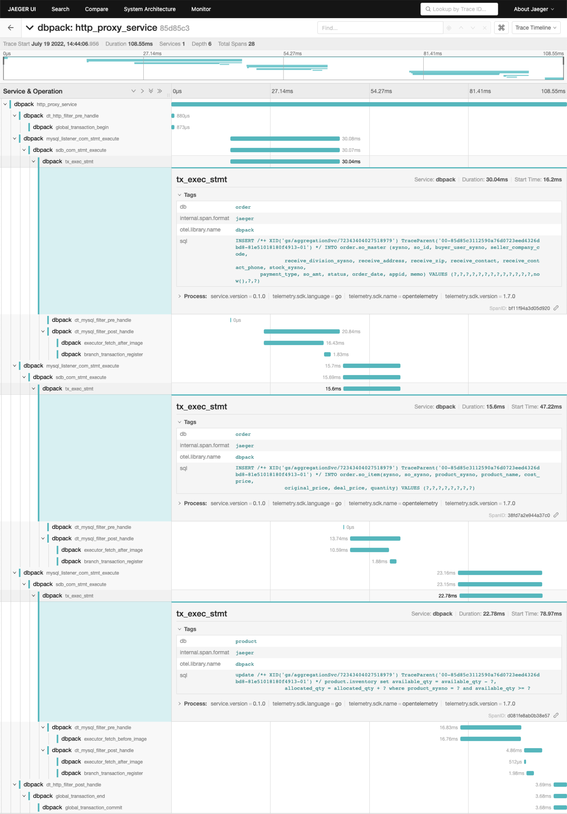

# DBPack SQL Tracing 功能及数据加密功能详解

上周，我们正式发布了 DBPack SQL Tracing 功能和数据加密功能，现对这两个功能做如下说明。

## SQL Tracing

通过 DBPack 代理开启的全局事务，会自动在 http header 中注入 `traceparent`，`traceparent` 的值如下：

`00-85d85c3112590a76d0723eed4326dbd8-81e51018180f4913-01`

该值的格式是：

```golang
fmt.Sprintf("%.2x-%s-%s-%s",
		supportedVersion,
		sc.TraceID(),
		sc.SpanID(),
		flags)
```

其中包含了 `TraceID` 和 `SpanID`。用户可用该值在自己的微服务中构造 TraceContext，在业务中传递，以此得到一个分布式事务的完整链路。

`traceparent` 还可以通过 SQL 传递到 DBPack，以此来对 DBPack 中的执行逻辑进行链路追踪。

例如：

```
update /*+ XID('gs/aggregationSvc/72343404027518979') TraceParent('00-85d85c3112590a76d0723eed4326dbd8-81e51018180f4913-01') */ product.inventory set available_qty = available_qty - ?, allocated_qty = allocated_qty + ? where product_sysno = ? and available_qty >= ?
```

完整的 sample 请参考：https://github.com/cectc/dbpack-samples/tree/main/go

DBPack 支持将链路追踪结果导出到 jaeger，只需要在 DBPack 的配置文件中增加如下配置：

```yaml
trace:
  jaeger_endpoint: http://jaeger:14268/api/traces # 替换为实际的 jaeger 地址
```

下图展示了一个完整分布式事务的 trace 链路数据，可以看到通过 DBPack 在哪个 DB 上执行了什么 SQL 请求，以及耗时：



## 数据加密

DBPack 采用 AES 算法来加密数据。在插入和更新相应的数据时，DBPack 会对相关的列进行自动加密。当查询结果中存在相关的列时，DBPack 会自动解密。DBPack 不支持使用加密列作为 `WHERE` 条件。

开启加解密功能需通过在配置文件中增加 `CryptoFilter` 配置。例如：

```yaml
executors:
  - name: redirect
    mode: sdb
    config:
      data_source_ref: employees
    filters:
      - cryptoFilter
filters:
  - name: cryptoFilter
    kind: CryptoFilter
    conf:
      column_crypto_list:
      - table: departments
        columns: ["dept_name"]
        aeskey: 123456789abcdefg
```

上面的配置表示需要对 `departments` 表的 `dept_name` 列进行自动加解密。

+ 插入操作：

```
INSERT INTO departments (id,dept_no,dept_name) VALUES (1,'1001','sunset')
```

会被重写为：

```
INSERT INTO departments (id,dept_no,dept_name) VALUES (1,'1001','3d244141cb5b6f921923f7f88f073941')
```

+ 更新操作：

```
UPDATE departments SET dept_name='moonlight' WHERE id=1
```

会被重写为：

```
UPDATE departments SET dept_name='5cdeb84b8fc3c22fd6c3e37ca6d837da' WHERE id=1
```

+ 查询时会自动解密返回给用户

注意：设置对指定的列加密后，数据库里只保存密文，不会保存明文，防止被拖库后数据泄漏。加密后的列数据比原本的数据要长，需设置好对应列的长度。

## 综述

在 v0.1.0 版本我们发布了分布式事务功能，支持各种编程语言协调分布式事务。

在 v0.2.0 版本我们发布了读写分离功能，用户在开启读写分离功能的情况下，使用分布式事务协调功能不再需要做复杂的集成，DBPack 提供了一站式的解决方案。

在 v0.3.0 版本，我们加入 SQL Tracing 的功能，使用该功能可以收集到一个完整的分布式事务链路，查看事务的执行情况。我们还加入了数据加密功能，通过该功能保护用户的重要数据资产。

## 链接

- dbpack: https://github.com/CECTC/dbpack
- dbpack-samples: https://github.com/CECTC/dbpack-samples
- dbpack-doc: https://github.com/CECTC/dbpack-doc
- 事件驱动分布式事务设计：https://mp.weixin.qq.com/s/r43JvRY3LCETMoZjrdNxXA
- 视频介绍：
  - 《dbpack 分布式事务功能详解》 https://www.bilibili.com/video/BV1cg411X7Ek
  - 《高性能分布式事务框架实践》https://www.bilibili.com/video/BV1Xr4y1L7kD

