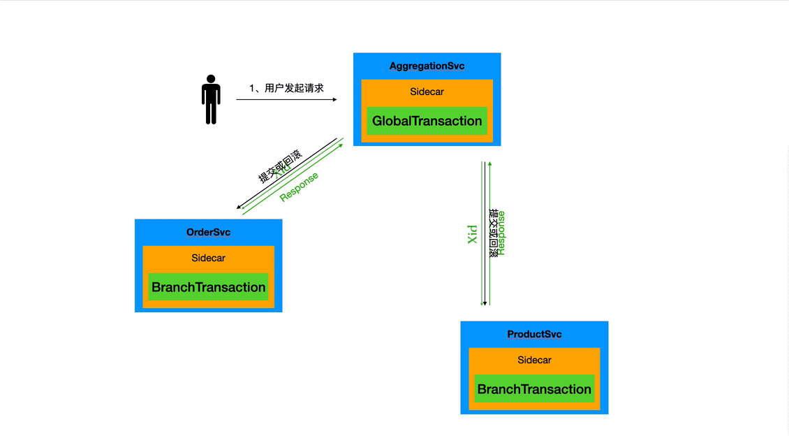

# AT 模式



+ 用户对聚合层服务发起请求后，经过 sidecar 的拦截，生成 `GlobalTransaction` 数据，并产生全局唯一标记 `XID`。

***

+ 调用订单服务时，通过 HTTP Header 传递 `XID` 到订单服务上下文 (Context)。

+ 将 `XID` 用 `Hint` 的的方式，添加到要执行的 SQL 语句中。例如：

  ```sql
  INSERT /*+ XID('%s') */ INTO seata_order.so_master (sysno, so_id, buyer_user_sysno, seller_company_code, receive_division_sysno, receive_address, receive_zip, receive_contact, receive_contact_phone, stock_sysno, payment_type, so_amt, status, order_date, appid, memo) VALUES (?,?,?,?,?,?,?,?,?,?,?,?,?,now(),?,?)
  ```

+ 执行业务 SQL。

+ DBPack sidecar 拦截到要执行的业务 SQL，检测 SQL 上是否是否带有 Hint 标记。如果有，则将该 SQL 执行前后的数据构造成 `UndoLog` 记录下来，并生成 `BranchTransaction` 数据。

***

+ 调用商品服务时，通过 HTTP Header 传递 `XID` 到商品服务上下文 (Context)。

+ 将 `XID` 用 `Hint` 的的方式，添加到要执行的 SQL 语句中。例如：

  ```sql
  update /*+ XID('%s') */ seata_product.inventory set available_qty = available_qty - ?, allocated_qty = allocated_qty + ? where product_sysno = ? and available_qty >= ?
  ```

+ 执行业务 SQL。

+ DBPack sidecar 拦截到要执行的业务 SQL，检测 SQL 上是否是否带有 Hint 标记。如果有，则将该 SQL 执行前后的数据构造成 `UndoLog` 记录下来，并生成 `BranchTransaction` 数据。

***

+ 回到聚合层服务，业务逻辑执行完毕，如果业务执行成功没有异常，则根据 `XID` 获取 `BranchTransaction` 通知事务分支提交，删除 `UndoLog`；如果业务执行失败，则根据 `XID` 获取 `BranchTransaction` 通知事务分支回滚，根据 `UndoLog` 生成反向回滚语句。

<br>

站在全局的视角，上述的过程，可抽象为下面的步骤：

```sql
session1:
    START TRANSACTION
        INSERT /*+ XID('localhost:8092:2612341069705662465') */ INTO seata_order.so_master (sysno, so_id, buyer_user_sysno, seller_company_code, receive_division_sysno, receive_address, receive_zip, receive_contact, receive_contact_phone, stock_sysno, payment_type, so_amt, status, order_date, appid, memo) VALUES (?,?,?,?,?,?,?,?,?,?,?,?,?,now(),?,?)
        INSERT /*+ XID('localhost:8092:2612341069705662465') */ INTO seata_order.so_item(sysno, so_sysno, product_sysno, product_name, cost_price, original_price, deal_price, quantity) VALUES (?,?,?,?,?,?,?,?)
    COMMIT

session2:
    START TRANSACTION
        UPDATE /*+ XID('localhost:8092:2612341069705662465') */ seata_product.inventory set available_qty = available_qty - ?, allocated_qty = allocated_qty + ? WHERE product_sysno = ? and available_qty >= ?
    COMMIT
```

通过 `XID` 串起了事务的整个生命周期。

