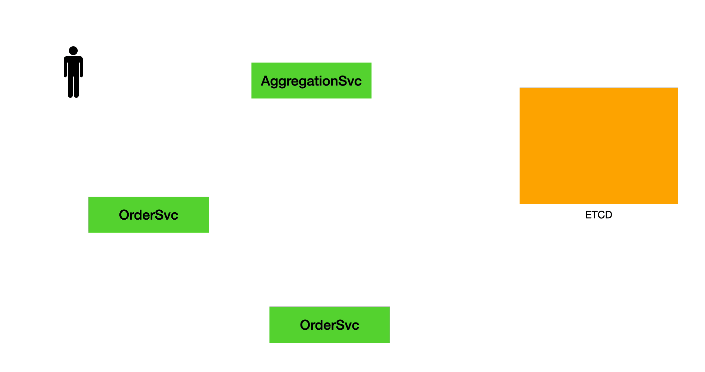

# EAT 模式

## 一、UndoLog

我们会在 SQL 执行时记录 UndoLog。在全局事务提交时异步删除 UndoLog；在全局事务回滚时异步执行 SQL 补偿语句回滚数据。

下面以 departments 表为例，说明 UndoLog 的生成逻辑。departments 表结构如下：

```sql
CREATE TABLE `departments` (
  `id` bigint NOT NULL AUTO_INCREMENT,
  `dept_no` char(4) COLLATE utf8mb4_unicode_ci NOT NULL,
  `dept_name` varchar(100) COLLATE utf8mb4_unicode_ci NOT NULL,
  PRIMARY KEY (`id`),
  UNIQUE KEY `dept_name` (`dept_name`)
) ENGINE=InnoDB DEFAULT CHARSET=utf8mb4 COLLATE=utf8mb4_unicode_ci;
```

假如应用执行了如下的 SQL：

```sql
update departments set dept_name = 'moonlight' where dept_name = 'sunset';
```

DBPack 会在这个 SQL 执行之前，解析这个 SQL 语句，查询前镜像：

```sql
select id, dept_no, dept_name from departments where dept_name = 'sunset';
```

获取到的前镜像如下：

| id   | dept_no | dept_name |
| ---- | ------- | --------- |
| 230  | 1001    | sunset    |

执行业务 SQL，该 department 的名字被更新为 `moonlight`，执行后，根据前镜像的主键获取后镜像：

```sql
select id, dept_no, dept_name from departments where id = 230
```

获取到的后镜像为：

| id   | dept_no | dept_name |
| ---- | ------- | --------- |
| 230  | 1001    | moonlight |

将前后镜像序列化后，形成下列数据结构：

```json
{
	"is_binary": true,
	"sql_type": "UPDATE",
	"schema_name": "employees",
	"table_name": "departments",
	"lock_key": "departments:230",
	"after_image": {
		"rows": [{
			"fields": [{
				"key_type": "pk",
				"name": "id",
				"type": 4,
				"value": 230
			}, {
				"name": "dept_no",
				"type": 12,
				"value": "1001"
			}, {
				"name": "dept_name",
				"type": 12,
				"value": "moonlight"
			}]
		}],
		"table_name": "departments"
	},
	"before_image": {
		"rows": [{
			"fields": [{
				"key_type": "pk",
				"name": "id",
				"type": 4,
				"value": 230
			}, {
				"name": "dept_no",
				"type": 12,
				"value": "1001"
			}, {
				"name": "dept_name",
				"type": 12,
				"value": "sunset"
			}]
		}],
		"table_name": "departments"
	},
}
```

这里为了展示方便使用了 Json 结构展示，在 DBPack 中，UndoLog 通过 Protobuffer 序列化。


## 二、SQL 补偿

+ INSERT 操作

  通过 UndoLog 构造 DELETE 补偿语句。

  ```sql
  DELETE FROM {table_name} WHERE id = ?
  ```

+ DELETE 操作

  通过 UndoLog 构造 INSERT 补偿语句。

  ```sql
  INSERT INTO {table_name} ({columns}) VALUES ({values})
  ```

+ UPDATE 操作

  通过 UndoLog 构造 UPDATE 补偿语句。

  ```
  UPDATE {table_name} SET {columns} = {values} WHERE id = ?
  ```


## 三、流程



+ 请求发到聚合层服务后，在 etcd 写入全局事务数据，产生唯一标识 xid（比如：gs/aggregationSvc/2612341069705662465）。

***

+ 调用订单服务时，通过 HTTP Header 传递 `XID` 到订单服务上下文 (Context)。

+ 将 `XID` 用 `Hint` 的的方式，添加到要执行的 SQL 语句中。例如：

  ```sql
  INSERT /*+ XID('%s') */ INTO order.so_master (sysno, so_id, buyer_user_sysno, seller_company_code, receive_division_sysno, receive_address, receive_zip, receive_contact, receive_contact_phone, stock_sysno, payment_type, so_amt, status, order_date, appid, memo) VALUES (?,?,?,?,?,?,?,?,?,?,?,?,?,now(),?,?)
  ```

+ 执行业务 SQL。

+ DBPack sidecar 拦截到要执行的业务 SQL，检测 SQL 上是否是否带有 Hint 标记。如果有，则将该 SQL 执行前后的数据构造成 `UndoLog` 记录下来，在 etcd 写入 `BranchTransaction` 数据，并跟 xid 关联一个 key (比如：gs/aggregationSvc/2612341069705662465/${branchid})，表示 xid 下存在一个事务分支。

***

+ 调用商品服务时，通过 HTTP Header 传递 `XID` 到商品服务上下文 (Context)。

+ 将 `XID` 用 `Hint` 的的方式，添加到要执行的 SQL 语句中。例如：

  ```sql
  update /*+ XID('%s') */ product.inventory set available_qty = available_qty - ?, allocated_qty = allocated_qty + ? where product_sysno = ? and available_qty >= ?;
  ```

+ 执行业务 SQL。

+ DBPack sidecar 拦截到要执行的业务 SQL，检测 SQL 上是否是否带有 Hint 标记。如果有，则将该 SQL 执行前后的数据构造成 `UndoLog` 记录下来，在 etcd 写入 `BranchTransaction` 数据，并跟 xid 关联一个 key (比如：gs/aggregationSvc/2612341069705662465/${branchid2})，表示 xid 下存在一个事务分支。

***

+ 回到聚合层服务，业务逻辑执行完毕，如果业务执行成功没有异常，则根据 `XID` 获取 `BranchTransaction` 修改分支状态为提交，sidecar watch 到分支事务 key 变化立即删除 `UndoLog`；如果业务执行失败，则根据 `XID` 获取 `BranchTransaction` 修改分支状态为回滚，sidecar watch 到分支事务 key 变化根据 `UndoLog` 生成反向回滚语句。

<br>

站在全局的视角，上述的过程，可抽象为下面的步骤：

```sql
# session1:
    START TRANSACTION;
        INSERT /*+ XID('gs/aggregationSvc/2612341069705662465') */ INTO order.so_master (sysno, so_id, buyer_user_sysno, seller_company_code, receive_division_sysno, receive_address, receive_zip, receive_contact, receive_contact_phone, stock_sysno, payment_type, so_amt, status, order_date, appid, memo) VALUES (?,?,?,?,?,?,?,?,?,?,?,?,?,now(),?,?);
        INSERT /*+ XID('gs/aggregationSvc/2612341069705662465') */ INTO order.so_item(sysno, so_sysno, product_sysno, product_name, cost_price, original_price, deal_price, quantity) VALUES (?,?,?,?,?,?,?,?);
    COMMIT;

# session2:
    START TRANSACTION;
        UPDATE /*+ XID('gs/aggregationSvc/2612341069705662465') */ product.inventory set available_qty = available_qty - ?, allocated_qty = allocated_qty + ? WHERE product_sysno = ? and available_qty >= ?;
    COMMIT;
```

通过 `XID` 串起了事务的整个生命周期。

