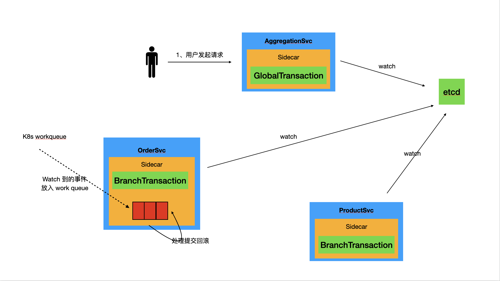

# TCC 模式

+ 用户对聚合层服务发起请求后，经过 sidecar 的拦截，生成 `GlobalTransaction` 数据，并产生全局唯一标记 `XID`。

***

+ 调用订单服务时，通过 HTTP Header 传递 `XID` 到订单服务上下文 (Context)。
+ 请求经过 sidecar 拦截，检测 HTTP Header 中存在 `XID`，则将请求 Body 序列化后，作为 `BranchTransaction` 携带的数据一并持久化到 ETCD。

***

+ 调用订单服务时，通过 HTTP Header 传递 `XID` 到订单服务上下文 (Context)。
+ 请求经过 sidecar 拦截，检测 HTTP Header 中存在 `XID`，则将请求 Body 序列化后，作为 `BranchTransaction` 携带的数据一并持久化到 ETCD。

***

+ 回到聚合层服务，业务逻辑执行完毕，如果业务执行成功没有异常，则根据 `XID` 获取 `BranchTransaction`，使用其携带的请求 Body 数据调用对应的 `Commit` 请求；如果业务执行失败，则根据 `XID` 获取 `BranchTransaction`，使用其携带的请求 Body 数据调用对应的 `Rollback` 请求。

