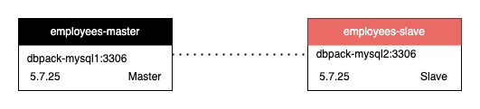

# Read Write Splitting

+ DBPack can route SQLs automatically according to their type, for example, `Insert`、`Update`、`Delete` SQL will be routed to master DB, and `Select` SQL will be routed to slave DB.

+ Alternatively, users can specify which DB to use by adding Hint `UseDB('%s')` in SQL. For example: `SELECT /*+ UseDB('employees-master') */ emp_no, birth_date, first_name, last_name, gender, hire_date FROM employees WHERE emp_no = ?`.

+ If the SQL is in a transaction, all the SQL query will be routed to master DB.

+ DBPack will exclude slave DBs by following policy:

  ```
      ping_interval: 20s
      ping_times_for_change_status: 3
  ```

  By setting the interval and count for `ping` DB, DBPack will check DB status periodically. In upper configuration, if the `ping` failed 3 times continuously, the DB status will be updated to `Unknown`; On the other hand, if `ping` succeed 3 times continuously, the DB status will be updated to `Running`. There will be no traffic route to DB of `Unknown` status.

Here is a config example:

```yaml
executors:
  - name: redirect
    mode: rws
    config:
      load_balance_algorithm: RandomWeight
      data_sources:
        - name: employees-master
          weight: r0w10
        - name: employees-slave
          weight: r10w0

data_source_cluster:
  - name: employees-master
    capacity: 10
    max_capacity: 20
    idle_timeout: 60s
    dsn: root:123456@tcp(dbpack-mysql1:3306)/employees?timeout=60s&readTimeout=60s&writeTimeout=60s&parseTime=true&loc=Local&charset=utf8mb4,utf8
    ping_interval: 20s
    ping_times_for_change_status: 3
    filters:
      - mysqlDTFilter

  - name: employees-slave
    capacity: 10
    max_capacity: 20
    idle_timeout: 60s
    dsn: root:123456@tcp(dbpack-mysql2:3306)/employees?timeout=60s&readTimeout=60s&writeTimeout=60s&parseTime=true&loc=Local&charset=utf8mb4,utf8
    ping_interval: 20s
    ping_times_for_change_status: 3
```

employees-master is master datasource，employees-slave is slave datasource。



The tag of master/slave is marked by `weight` field. `r0w10` marks for the weights of read and write. The number `10` after `w`, which > 0, means that the datasource is the master datasource. Only when the load balancing algorithm is configured to `RandomWeight` shall the traffic been route according to the weights. Besides `RandomWeight`, it also support `Random` and `RoundRobin` algorithm, which respectively means random datasource to route and round-robin route. Users can configure `write` weights for those master datasource if they configured multiple master datasource and master-slave duplication.

For example:


Following is a config example that has 2 master and 2 slave datasource.

```
      data_sources:
        - name: employees-master1
          weight: r0w6
        - name: employees-master2
          weight: r3w4
        - name: employees-slave1
          weight: r3w0
        - name: employees-slave2
          weight: r4w0        
```

The `read` weights for employees-master2 is 3, the `write` weight is 4, meaning that the datasource is readable and writable. 
