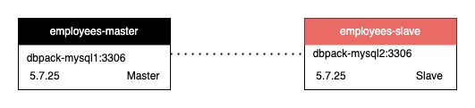
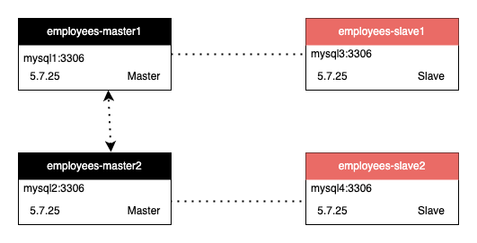

# 读写分离

+ DBPack 能根据 SQL 操作的类型，自动路由 `Insert`、`Update`、`Delete` 请求到主库，`Select` 请求到从库。

+ DBPack 还能通过 Hint `UseDB('%s')` 自定义查询请求路由。

+ 在开启事务的情况下，所有请求都将路由到主库。

+ DBPack 支持通过如下策略剔除无法访问的从库：

  ```
      ping_interval: 20s
      ping_times_for_change_status: 3
  ```

  通过设置 `ping` 数据库的间隔，以及 `ping` 的次数，来改变 DB 的状态。在上面的例子中，如果连续三次 `ping` 失败，则 DB 的状态改为 `Unkown`，如果连续三次 `ping` 成功，则 DB 的状态改为 `Running`。`Unknown` 状态的 DB 将不会获得访问流量。

下面是一个例子：

```golang
executors:
  - name: redirect
    mode: rws
    config:
      load_balance_algorithm: RandomWeight
      data_sources:
        - name: employees-master
          weight: r0w10
        - name: employees-slave
          weight: r10w0

data_source_cluster:
  - name: employees-master
    capacity: 10
    max_capacity: 20
    idle_timeout: 60s
    dsn: root:123456@tcp(dbpack-mysql1:3306)/employees?timeout=60s&readTimeout=60s&writeTimeout=60s&parseTime=true&loc=Local&charset=utf8mb4,utf8
    ping_interval: 20s
    ping_times_for_change_status: 3
    filters:
      - mysqlDTFilter

  - name: employees-slave
    capacity: 10
    max_capacity: 20
    idle_timeout: 60s
    dsn: root:123456@tcp(dbpack-mysql2:3306)/employees?timeout=60s&readTimeout=60s&writeTimeout=60s&parseTime=true&loc=Local&charset=utf8mb4,utf8
    ping_interval: 20s
    ping_times_for_change_status: 3
```

employees-master 为主数据源，employees-slave 为从数据源。



主从的标识是通过 `weight` 字段标识的。`r0w10` 标识了读写的权重，`w` 后的数字大于 0，表示该数据源为主数据源。只有在负载均衡算法是 `RandomWeight` 时，才按照权重路由请求。除 `RandomWeight` 还支持  `Random`、`RoundRobin`，分别在数据源之间随机选择数据源路由请求和轮询依次路由请求。如果用户有多个主数据源，做了主主复制，可配置多个主数据源的 `write` 权重。

例如：



在这个结构中两主两从 4 个数据源。可参考下面的配置：

```
      data_sources:
        - name: employees-master1
          weight: r0w6
        - name: employees-master2
          weight: r3w4
        - name: employees-slave1
          weight: r3w0
        - name: employees-slave2
          weight: r4w0        
```

employees-master2 的 `read` 权重为 3，`write` 权重为 4，表示该数据源可读可写。

