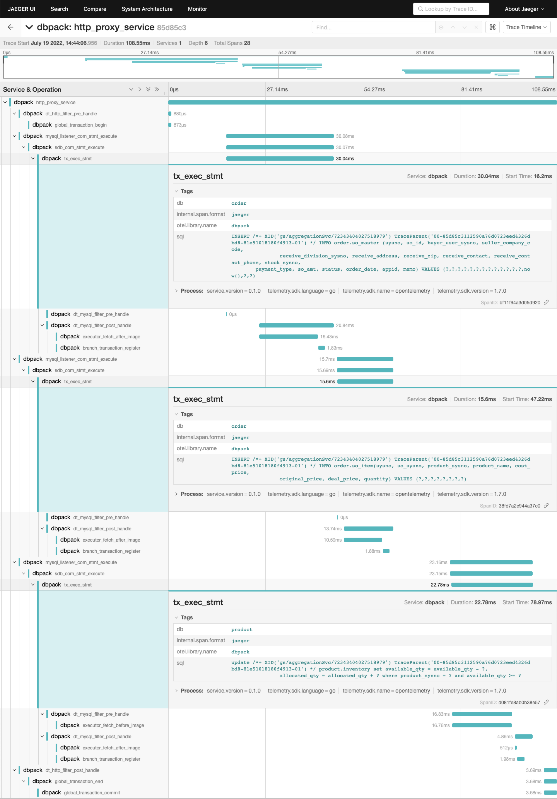

# 链路追踪

通过 DBPack 代理开启的全局服务，会自动在 http header 中注入 `traceparent`，`traceparent` 的值如下：

`00-85d85c3112590a76d0723eed4326dbd8-81e51018180f4913-01`

该值的格式是：

```golang
fmt.Sprintf("%.2x-%s-%s-%s",
		supportedVersion,
		sc.TraceID(),
		sc.SpanID(),
		flags)
```

其中包含了 `TraceID` 和 `SpanID`。用户可用该值在自己的微服务中构造 TraceContext，在业务中传递，以此得到一个分布式事务的完整链路。

`traceparent` 还可以通过 SQL 传递到 DBPack，以此来对 DBPack 中的执行逻辑进行链路追踪。

例如：

```
update /*+ XID('gs/aggregationSvc/72343404027518979') TraceParent('00-85d85c3112590a76d0723eed4326dbd8-81e51018180f4913-01') */ product.inventory set available_qty = available_qty - ?, allocated_qty = allocated_qty + ? where product_sysno = ? and available_qty >= ?
```

完整的 sample 请参考：https://github.com/cectc/dbpack-samples/tree/main/go

DBPack 支持将链路追踪结果导出到 jaeger，只需要在 DBPack 的配置文件中增加如下配置：

```yaml
trace:
  jaeger_endpoint: http://jaeger:14268/api/traces # 替换为实际的 jaeger 地址
```

下图展示了一个完整分布式事务的 trace 链路数据，可以看到通过 DBPack 在哪个 DB 上执行了什么 SQL 请求，以及耗时：

